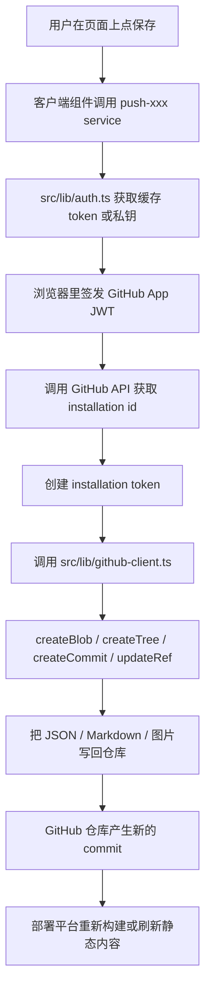

# 2025 Blog 项目结构、`'use client'`、配置与启动流程说明

这份文档专门回答下面这些问题：

- 这个项目整体怎么读
- `.next` 里到底是什么
- 为什么 `src/layout/index.tsx` 和 `src/layout/header.tsx` 都写了 `'use client'`
- 哪些文件写了 `'use client'`，为什么是这些文件
- 哪些是服务端组件，哪些默认不是
- 哪些配置文件真的值得手动改
- 项目入口在哪里，启动时一步一步读哪些文件
- `.next`、`.agents`、`.vscode`、`node_modules`、`public`、`scripts` 分别做什么
- 是否需要流程图来帮助理解

---

## 1. 先给结论

这是一个基于 `Next.js 16 + App Router + React 19 + Tailwind CSS v4 + Zustand + SWR` 的个人博客项目，但它不是“纯展示型博客”。

它的核心结构其实是：

```text
Next.js 前端应用
  + public/ 里的 Markdown / JSON / 图片作为内容源
  + 浏览器端使用 GitHub App 私钥换 token
  + 直接调用 GitHub API 把内容改回仓库
```

所以这个项目要分成两条线去看：

1. 代码入口线：Next.js 怎么启动、怎么路由、怎么渲染
2. 内容数据线：页面怎么从 `public/` 读取内容，又怎么把内容写回 GitHub

---

## 2. 这项目用的是什么架构

### 2.1 框架和运行方式

从 `package.json` 可以确认：

- 开发命令：`next dev --turbopack -p 2025`
- 构建命令：`next build`
- 生产启动：`next start`
- 还额外支持 Cloudflare / OpenNext 部署：
  - `opennextjs-cloudflare build`
  - `opennextjs-cloudflare preview`
  - `opennextjs-cloudflare deploy`

也就是说，这个仓库本质上是：

- 一个 Next.js App Router 项目
- 本地开发用 Turbopack
- 内容层大量依赖 `public/` 中的文件
- 编辑能力通过浏览器端直接连 GitHub API 完成

### 2.2 路由模式

这个仓库没有 `pages/`，只有 `src/app/`，所以它是标准 App Router 项目。

当前路由主要来自这些文件：

```text
src/app/(home)/page.tsx
src/app/about/page.tsx
src/app/blog/page.tsx
src/app/blog/[id]/page.tsx
src/app/bloggers/page.tsx
src/app/clock/page.tsx
src/app/image-toolbox/page.tsx
src/app/live2d/page.tsx
src/app/pictures/page.tsx
src/app/projects/page.tsx
src/app/share/page.tsx
src/app/snippets/page.tsx
src/app/svgs/page.tsx
src/app/write/page.tsx
src/app/write/[slug]/page.tsx
src/app/wuthering-waves/page.tsx
src/app/rss.xml/route.ts
src/app/sitemap.ts
```

`.next/dev/types/routes.d.ts` 里也能看到自动生成的路由类型。

---

## 3. 真正的入口文件在哪

### 3.1 全局根入口

真正的根入口是：

```text
src/app/layout.tsx
```

它是 Next.js App Router 约定的全局根布局。所有页面都会先经过这里。

这个文件主要做了几件事：

- 引入全局样式 `src/styles/globals.css`
- 从 `src/config/site-content.json` 读取网站标题、描述、主题色
- 生成 `metadata`
- 把主题色写进 `<html>` 的 CSS 变量
- 渲染自定义 `Head`
- 用 `src/layout/index.tsx` 这个全局布局外壳包住所有页面

### 3.2 全站视觉壳入口

被 `src/app/layout.tsx` 包进去的下一层是：

```text
src/layout/index.tsx
```

这个文件不是 Next.js 的约定入口，但它是这个仓库“真正的全站 UI 外壳”。

它负责：

- 初始化屏幕尺寸和中心点状态
- 渲染背景图和背景气泡
- 渲染 toast 提示
- 渲染全局导航卡片 `NavCard`
- 渲染全局音乐卡片 `MusicCard`
- 在移动端显示回到顶部按钮

### 3.3 首页入口

首页真正页面入口是：

```text
src/app/(home)/page.tsx
```

这里的 `(home)` 是路由分组，不会出现在 URL 上。也就是说：

- 文件路径是 `src/app/(home)/page.tsx`
- 实际路由仍然是 `/`

这个页面负责把首页所有卡片组装起来，例如：

- `ArtCard`
- `HiCard`
- `ClockCard`
- `CalendarCard`
- `SocialButtons`
- `ShareCard`
- `AritcleCard`
- `WriteButtons`
- `LikePosition`
- `HatCard`
- `BeianCard`

---

## 4. 启动项目时，一步一步会读哪些东西

这里分成两层看：

- 启动开发服务器时会读什么
- 第一次访问 `/` 时会读什么

### 4.1 启动开发服务器

执行：

```bash
npm run dev
```

等价于：

```bash
next dev --turbopack -p 2025
```

我实际启动过一次，这个仓库当前确实会监听 `2025` 端口。

启动阶段，Next.js 主要会处理这些内容：

1. 读取 `package.json` 中的 `dev` 脚本
2. 读取 `next.config.ts`
3. 读取 `tsconfig.json`
4. 读取环境变量
   - `.env*` 文件如果存在会被 Next.js 自动读入
   - 这个仓库当前没有提交 `.env` 文件
5. 扫描 `src/app/` 路由树
6. 生成 `.next/dev/types/routes.d.ts` 等类型文件
7. 准备 `.next/dev/server`、`.next/dev/static`、`.next/dev/build` 等开发产物目录

当真正开始编译页面时，还会继续读到：

8. `src/app/layout.tsx` 中引入的 `src/styles/globals.css`
9. `src/styles/globals.css` 继续 `@import`
   - `tailwindcss`
   - `katex/dist/katex.min.css`
   - `src/styles/theme.css`
   - `src/styles/article.css`
10. `postcss.config.mjs`
    - 用于挂载 `@tailwindcss/postcss`

### 4.2 第一次访问首页 `/`

`.next/dev/trace` 里已经记录了真实的开发期请求链路。首次访问 `/` 时可以看到：

```text
handle-request  url="/"
ensure-page     inputPage="/(home)/page"
compile-path    trigger="/"
```

也就是说，第一次打开首页时的关键链路是：

1. 处理请求 `/`
2. 将 `/` 路由映射到 `/(home)/page`
3. 编译首页相关模块
4. 执行 `src/app/layout.tsx`
5. 执行 `src/layout/head.tsx`
6. 执行 `src/layout/index.tsx`
7. 执行 `src/app/(home)/page.tsx`
8. 继续加载页面里用到的卡片组件、hooks、样式、SVG、静态资源
9. 浏览器 hydration 后，再启用前端交互

### 4.3 首页完整渲染流程图

```mermaid
flowchart TD
  A[npm run dev] --> B[package.json -> next dev --turbopack -p 2025]
  B --> C[读取 next.config.ts / tsconfig.json / env]
  C --> D[扫描 src/app 路由树]
  D --> E[生成 .next/dev 下的类型与 manifest]
  E --> F[浏览器请求 /]
  F --> G[Next 识别为 /(home)/page]
  G --> H[src/app/layout.tsx]
  H --> I[src/layout/head.tsx]
  H --> J[src/layout/index.tsx]
  J --> K[src/app/(home)/page.tsx]
  K --> L[首页卡片组件树]
  L --> M[浏览器 hydration]
  M --> N[交互生效: 拖拽/弹窗/动画/音乐/滚动]
```

### 4.4 以文章详情页为例，它还会继续读取哪些内容

如果你访问的是：

```text
/blog/<slug>
```

那么链路除了根布局之外，还会继续经过：

1. `src/app/blog/[id]/page.tsx`
2. 页面里调用 `src/lib/load-blog.ts`
3. 浏览器再去请求：
   - `/blogs/<slug>/config.json`
   - `/blogs/<slug>/index.md`
4. `src/components/blog-preview.tsx` 再把 Markdown 渲染出来

所以文章详情页不是“服务端直接把整篇文章塞进 HTML”，而是：

```text
先进入客户端页面
  -> 再从 public/blogs 下拉文章配置和 markdown
  -> 再在浏览器端渲染
```

---

## 5. 为什么 `src/layout/index.tsx` 和 `src/layout/header.tsx` 都有 `'use client'`

这个问题要分开回答，因为两者性质不一样。

### 5.1 `src/layout/index.tsx` 为什么必须有 `'use client'`

`src/layout/index.tsx` 必须是客户端组件，原因非常明确：

- 它调用了 `useCenterInit()` 和 `useSizeInit()`
- 它读取 Zustand 状态 `useConfigStore()`、`useSize()`
- 它渲染 `Toaster`
- 它渲染 `NavCard`、`MusicCard`、`ScrollTopButton` 这类明显依赖浏览器交互的组件

这些都要求它在浏览器端执行，所以它需要作为一个“客户端边界文件”，文件头必须写：

```tsx
'use client'
```

### 5.2 `src/layout/header.tsx` 为什么现在也写了 `'use client'`

`src/layout/header.tsx` 当前内容非常简单：

```tsx
'use client'

export default function Header() {
  return <header></header>
}
```

而且它目前没有被任何地方引用。

所以结论很直接：

- 这个文件现在并不“需要” `'use client'`
- 它更像是预留文件或遗留文件
- 就当前代码来看，把 `'use client'` 去掉也不会影响现有功能

### 5.3 一个很容易误解的点

`'use client'` 不是“哪个目录叫 layout 就必须写”，也不是“所有子组件都要写”。

它真正的规则是：

- 只有“客户端边界入口文件”必须写 `'use client'`
- 被这个客户端边界继续导入的子模块，即使自己没写 `'use client'`，也会进入客户端模块图

这个仓库里最典型的例子就是：

```text
src/layout/backgrounds/blurred-bubbles.tsx
```

它自己没有写 `'use client'`，但它内部用了 `useEffect`、`useRef`。之所以还能工作，是因为它只被 `src/layout/index.tsx` 这个客户端边界导入，所以它实际也会被当成客户端模块打包。

因此：

- `src/layout/index.tsx` 的 `'use client'` 是必须的
- `src/layout/header.tsx` 的 `'use client'` 目前不是必须的

---

## 6. 这个项目里，哪些文件写了 `'use client'`

我实际扫描过一次，当前一共有：

```text
73 个文件
```

### 6.1 完整清单

#### `src/layout`

```text
src/layout/backgrounds/snowfall.tsx
src/layout/index.tsx
src/layout/header.tsx
```

#### `src/components`

```text
src/components/blog-sidebar.tsx
src/components/select.tsx
src/components/markdown-image.tsx
src/components/dialog-modal.tsx
src/components/nav-card.tsx
src/components/blog-toc.tsx
src/components/wip.tsx
src/components/scroll-top-button.tsx
src/components/music-card.tsx
src/components/card.tsx
src/components/color-picker-panel.tsx
src/components/code-block.tsx
src/components/liquid-grass/index.tsx
src/components/editable-star-rating.tsx
src/components/color-picker.tsx
src/components/blog-preview.tsx
```

#### `src/hooks`

```text
src/hooks/use-size.ts
src/hooks/use-center.ts
src/hooks/use-categories.ts
```

#### `src/lib`

```text
src/lib/blog-index.ts
src/lib/file-utils.ts
src/lib/github-client.ts
```

#### `src/app/projects`

```text
src/app/projects/components/project-card.tsx
src/app/projects/components/image-upload-dialog.tsx
src/app/projects/components/create-dialog.tsx
src/app/projects/page.tsx
```

#### `src/app/pictures`

```text
src/app/pictures/components/upload-dialog.tsx
src/app/pictures/components/random-layout.tsx
src/app/pictures/page.tsx
```

#### `src/app/share`

```text
src/app/share/components/share-card.tsx
src/app/share/components/create-dialog.tsx
src/app/share/components/logo-upload-dialog.tsx
src/app/share/page.tsx
src/app/share/grid-view.tsx
```

#### `src/app/live2d`

```text
src/app/live2d/live2d-viewer.tsx
src/app/live2d/page.tsx
```

#### `src/app/bloggers`

```text
src/app/bloggers/components/create-dialog.tsx
src/app/bloggers/components/blogger-card.tsx
src/app/bloggers/components/avatar-upload-dialog.tsx
src/app/bloggers/page.tsx
src/app/bloggers/grid-view.tsx
```

#### `src/app/write`

```text
src/app/write/page.tsx
src/app/write/[slug]/page.tsx
src/app/write/components/sections/cover-section.tsx
src/app/write/components/sections/images-section.tsx
```

#### `src/app/blog`

```text
src/app/blog/[id]/page.tsx
src/app/blog/components/category-modal.tsx
src/app/blog/page.tsx
```

#### `src/app/(home)`

```text
src/app/(home)/clock-card.tsx
src/app/(home)/config-dialog/home-layout.tsx
src/app/(home)/page.tsx
src/app/(home)/config-dialog/index.tsx
src/app/(home)/stores/layout-edit-store.ts
src/app/(home)/share-card.tsx
src/app/(home)/home-draggable-layer.tsx
src/app/(home)/config-dialog/site-settings/site-meta-form.tsx
src/app/(home)/config-dialog/site-settings/index.tsx
src/app/(home)/config-dialog/site-settings/background-images-section.tsx
src/app/(home)/config-dialog/site-settings/favicon-avatar-upload.tsx
src/app/(home)/config-dialog/site-settings/social-buttons-section.tsx
src/app/(home)/config-dialog/site-settings/hat-section.tsx
src/app/(home)/config-dialog/site-settings/beian-form.tsx
src/app/(home)/config-dialog/site-settings/art-images-section.tsx
src/app/(home)/config-dialog/color-config.tsx
```

#### 其他页面

```text
src/app/svgs/page.tsx
src/app/image-toolbox/page.tsx
src/app/snippets/page.tsx
src/app/wuthering-waves/page.tsx
src/app/about/page.tsx
src/app/clock/page.tsx
```

### 6.2 为什么偏偏是这些文件

它们大致可以分成 6 类：

#### 第一类：页面本身就是交互式页面

比如：

- `src/app/(home)/page.tsx`
- `src/app/blog/page.tsx`
- `src/app/blog/[id]/page.tsx`
- `src/app/write/page.tsx`
- `src/app/share/page.tsx`
- `src/app/projects/page.tsx`

这些页面直接用了：

- `useState`
- `useEffect`
- `useMemo`
- `useRouter`
- `useParams`
- `usePathname`
- 浏览器端 fetch
- toast
- 动画和拖拽

所以它们只能是客户端组件。

#### 第二类：弹窗、上传、拖拽、复制按钮一类组件

比如：

- `dialog-modal.tsx`
- 各种 `upload-dialog.tsx`
- `logo-upload-dialog.tsx`
- `avatar-upload-dialog.tsx`
- `code-block.tsx`
- `scroll-top-button.tsx`

这些组件要么依赖：

- `File`
- `FileReader`
- `navigator.clipboard`
- `window.scrollTo`
- 鼠标事件 / 键盘事件 / 表单输入

所以必须在浏览器端运行。

#### 第三类：页面动画和视口状态组件

比如：

- `src/components/card.tsx`
- `src/components/nav-card.tsx`
- `src/components/music-card.tsx`
- `src/layout/backgrounds/snowfall.tsx`
- `src/app/(home)/home-draggable-layer.tsx`

它们依赖：

- `motion`
- `window.innerWidth`
- `Audio`
- 滚动状态
- 拖拽状态

所以是客户端。

#### 第四类：hooks / store

比如：

- `src/hooks/use-size.ts`
- `src/hooks/use-center.ts`
- `src/hooks/use-categories.ts`
- `src/app/(home)/stores/layout-edit-store.ts`

它们依赖：

- `useEffect`
- `window`
- SWR
- Zustand

因此属于客户端状态层。

#### 第五类：浏览器文件处理与 GitHub API 写入模块

比如：

- `src/lib/file-utils.ts`
- `src/lib/github-client.ts`
- `src/lib/blog-index.ts`

这些文件虽然在 `lib/` 目录下，但它们不是“天然服务端库”，而是浏览器端逻辑的一部分：

- 处理 `FileReader`
- 处理 `crypto.subtle`
- 在浏览器里签发 JWT
- 直接从浏览器调用 GitHub API

#### 第六类：首页配置编辑器相关

`src/app/(home)/config-dialog/**` 这一整块几乎都是客户端，因为它本质上就是一个前端可视化配置面板。

---

## 7. 那哪些是服务端组件？是不是“其余的都默认服务端”？

不能简单地说“其余的都默认服务端”，要更准确一点。

### 7.1 App Router 的默认规则

在 Next.js App Router 中：

- 文件没有写 `'use client'` 时，默认是 Server Component
- 但是这句话主要针对“组件边界文件”成立

更精确的说法是：

- 没写 `'use client'` 的模块，可以被服务端组件直接导入
- 但如果它只被某个客户端边界导入，它就会进入客户端模块图

所以“文件在哪个目录”不是决定因素，“谁导入了它”才是关键因素之一。

### 7.2 这个仓库里，明确属于服务端侧的文件

下面这些文件可以明确看作服务端侧：

```text
src/app/layout.tsx
src/layout/head.tsx
src/layout/footer.tsx
src/app/sitemap.ts
src/app/rss.xml/route.ts
```

原因分别是：

- `src/app/layout.tsx`
  - 根布局
  - 负责 metadata 和 HTML 壳
  - 没写 `'use client'`
- `src/layout/head.tsx`
  - 由根布局服务端输出到 HTML
- `src/layout/footer.tsx`
  - 虽然没被使用，但它本身不是客户端组件
- `src/app/sitemap.ts`
  - 生成 sitemap
  - 明显是服务端/构建期逻辑
- `src/app/rss.xml/route.ts`
  - 路由处理器
  - 用了 `fs` 和 `path`
  - 明显是服务端逻辑

### 7.3 这个仓库里一个很重要的事实

当前 `src/app` 里的页面文件几乎全部都是客户端页面。

也就是说：

- 除了 `src/app/layout.tsx`
- 以及 `src/app/sitemap.ts`
- 以及 `src/app/rss.xml/route.ts`

其余主要 `page.tsx` 基本都显式写了 `'use client'`。

这说明这个项目明显偏“前端交互式 CMS”风格，而不是“服务端数据直出型博客”。

### 7.4 还有一个容易忽略的点：仓库里没有 `use server`

我实际扫过代码，这个仓库当前没有任何：

```tsx
'use server'
```

所以它不是靠 Server Actions 来完成内容写入的，而是走浏览器端 GitHub API。

### 7.5 一些“没写 `'use client'` 但实际在客户端图里”的典型例子

这些例子很重要，因为它们能帮助你真的理解边界规则：

```text
src/layout/backgrounds/blurred-bubbles.tsx
src/hooks/use-markdown-render.tsx
src/app/(home)/stores/config-store.ts
src/hooks/use-auth.ts
```

这些文件自己没写 `'use client'`，但由于只被客户端边界导入，所以它们实际依然参与客户端运行。

因此最准确的理解方式是：

- `'use client'` 标记的是“客户端入口边界”
- 不是“客户端世界里每个文件都必须单独贴标签”

---

## 8. `.next` 文件夹里都是什么，它是不是配置目录

不是。

`.next` 不是你手写的配置目录，而是 Next.js 的构建产物、缓存、开发期产物目录。

而且这个仓库当前 `.next` 下面实际是开发态产物：

```text
.next/dev
```

说明它现在保留的是 `next dev` 跑出来的文件，而不是 `next build` 产物。

### 8.1 当前这个仓库里的 `.next/dev` 主要内容

#### 1. manifest 文件

例如：

```text
.next/dev/build-manifest.json
.next/dev/fallback-build-manifest.json
.next/dev/routes-manifest.json
.next/dev/prerender-manifest.json
```

它们分别大致负责：

- 构建产物文件索引
- 路由映射
- 预渲染信息
- 浏览器需要加载哪些 chunk

例如：

- `routes-manifest.json` 里能看到 `/zh`、`/en` 被重定向到 `/`
- `prerender-manifest.json` 里有 preview mode 相关信息

#### 2. `server/` 目录

例如：

```text
.next/dev/server/app/(home)/page.js
.next/dev/server/app/(home)/page/app-paths-manifest.json
.next/dev/server/app/(home)/page/build-manifest.json
.next/dev/server/app/(home)/page/server-reference-manifest.json
```

这里存的是服务端侧编译结果、路由到编译文件的映射、RSC 相关 manifest。

#### 3. `static/` 目录

例如：

```text
.next/dev/static/chunks/*
```

这里存浏览器端需要的：

- JS chunks
- CSS chunks
- polyfill
- HMR 客户端脚本

#### 4. `build/` 目录

例如：

```text
.next/dev/build/chunks/*
```

这里更偏 Turbopack / dev build 的内部编译结果。

#### 5. `types/` 目录

例如：

```text
.next/dev/types/routes.d.ts
.next/dev/types/cache-life.d.ts
.next/dev/types/validator.ts
```

这里是 Next 自动生成的类型辅助文件。

#### 6. `cache/`、`logs/`、`trace`、`lock`

例如：

```text
.next/dev/cache/.rscinfo
.next/dev/logs/next-development.log
.next/dev/trace
.next/dev/lock
.next/dev/_events_18.json
```

这些分别大致负责：

- React Server Components 的开发缓存
- 开发日志
- 性能 trace
- 防止重复启动同一个 dev server
- 记录 CLI 事件

### 8.2 `.next` 里哪些“不要手改”

结论非常明确：

- `.next` 里的文件不要手改
- 也不应该把它当作项目配置入口
- 它应该被视为“可删可再生”的缓存/产物目录

`.gitignore` 里也明确忽略了 `.next/`。

---

## 9. `.agents`、`.vscode`、`node_modules`、`public`、`scripts` 都做什么

### 9.1 `.agents`

仓库里实际存在的是：

```text
.agents
```

不是 `.agent`。

当前这个目录是空的。

它通常用于：

- AI agent / 插件 / 本地自动化工具的元数据
- 某些 Codex 插件市场或代理配置

但就这个仓库当前状态来说：

- 它没有参与应用运行
- 你可以把它当成预留目录

### 9.2 `.vscode`

当前只有一个文件：

```text
.vscode/settings.json
```

内容很少，只是：

```json
{
  "svg.preview.background": "transparent"
}
```

作用是：

- 调整 VS Code 里 SVG 预览背景

它不影响项目运行逻辑。

### 9.3 `node_modules`

这是依赖安装目录。

它的职责是：

- 放所有 npm / pnpm 安装的依赖
- Next.js、React、Tailwind、Zustand、Motion、SWR 等都在这里

你通常不应该手改它里面的内容。

### 9.4 `public`

这是这个项目里非常重要的目录。

因为它不只是“放静态图标”，还承担了很大一部分内容源职责。

当前主要内容包括：

- `public/blogs/`
  - 博客正文 `index.md`
  - 博客配置 `config.json`
  - 博客索引 `index.json`
  - 分类 `categories.json`
  - 博客图片
- `public/images/`
  - 头像
  - 艺术图片
  - 分享图片
  - 博客主图
  - 站点装饰图
- `public/live2d/`
  - Live2D 模型文件
- `public/music/`
  - 音频文件
- `public/manifest.json`
  - PWA manifest
- `public/favicon.png`
  - 站点图标

这个目录里的内容，会直接以 URL 方式暴露出来，例如：

- `/blogs/xxx/index.md`
- `/images/avatar.png`
- `/music/close-to-you.mp3`

### 9.5 `scripts`

当前 `scripts` 目录只有一个脚本：

```text
scripts/gen-svgs-index.js
```

它做的事情是：

1. 扫描 `src/svgs/` 下所有 `.svg`
2. 按路径排序
3. 自动生成 `src/svgs/index.ts`
4. 继续监听 `src/svgs/` 的变化
5. 如果新增/删除/修改 `.svg`，1 秒节流后重新生成索引

所以它本质上是一个：

```text
SVG 资源注册表生成器 + watch 脚本
```

对应脚本命令是：

```json
"svg": "node scripts/gen-svgs-index.js"
```

注意，它当前是一个“长驻 watch 脚本”，因为文件尾部直接调用了 `startWatch()`。

---

## 10. 哪些配置文件才是你真正值得手改的

这里分成三档：

- 经常需要改
- 偶尔才改
- 基本不要手改

### 10.1 经常需要改

#### `src/config/site-content.json`

这是最重要的站点配置文件之一，控制：

- 站点标题、描述、用户名
- 主题色
- 背景色
- 艺术图
- 背景图
- 社交按钮
- 是否显示秒针
- 是否缓存私钥
- 是否隐藏编辑按钮
- 是否启用分类
- 帽子和备案等

如果你要“改网站内容和视觉基础设定”，这个文件非常重要。

#### `src/config/card-styles.json`

控制首页卡片：

- 宽高
- 顺序
- 偏移
- 启用/禁用

如果你要“改首页排布”，这个文件非常重要。

#### `src/consts.ts`

这个文件里最关键的是：

- `GITHUB_CONFIG.OWNER`
- `GITHUB_CONFIG.REPO`
- `GITHUB_CONFIG.BRANCH`
- `GITHUB_CONFIG.APP_ID`
- `GITHUB_CONFIG.ENCRYPT_KEY`

严格来说，这些更推荐放环境变量，但这个仓库作者也明确允许你直接改这里。

#### `public/manifest.json`

如果你真的要做 PWA 名称、图标、启动行为配置，这个文件需要改。

#### 内容文件本身

如果你不用前端界面改内容，而是手改仓库数据，那么这些也很重要：

- `public/blogs/**`
- `src/app/share/list.json`
- `src/app/projects/list.json`
- `src/app/bloggers/list.json`
- `src/app/pictures/list.json`
- `src/app/about/list.json`
- `src/app/snippets/list.json`

### 10.2 偶尔才改

#### `next.config.ts`

这个文件是框架级配置，当前主要控制：

- `reactCompiler`
- `pageExtensions`
- `typescript.ignoreBuildErrors`
- `experimental.scrollRestoration`
- SVG loader
- `/zh`、`/en` 重定向

只有你要改框架行为、构建行为、SVG 处理方式时，才需要碰它。

#### `src/styles/globals.css`

它是全局样式入口。

只有你要改：

- 全局 Tailwind v4 主题
- 全局 utility
- 全局基础元素样式

才需要直接修改。

#### `src/styles/theme.css`

它定义了默认主题变量。

但由于根布局已经会把 `site-content.json` 的颜色注入到 `<html>` 的 CSS 变量里，所以这个文件更像默认值，而不是唯一来源。

### 10.3 基本不要手改

这些通常不需要你日常手工编辑：

- `.next/**`
- `node_modules/**`
- `.vscode/settings.json`
- `.agents/`
- `pnpm-lock.yaml`
- `tsconfig.json`
- `postcss.config.mjs`
- `.npmrc`

除非你明确知道自己在调整什么。

---

## 11. 这个项目的内容是怎么“写回 GitHub”的

这个仓库最特别的一点就在这里。

它不是：

```text
前端 -> 自己的后端 API -> 数据库
```

而是：

```text
前端 -> GitHub App 私钥 -> JWT -> Installation Token -> GitHub API -> 直接改仓库文件
```

### 11.1 关键文件

主要链路在这些文件里：

```text
src/hooks/use-auth.ts
src/lib/auth.ts
src/lib/github-client.ts
src/app/(home)/services/push-site-content.ts
src/app/write/services/push-blog.ts
src/app/write/services/delete-blog.ts
src/app/blog/services/save-blog-edits.ts
src/app/blog/services/batch-delete-blogs.ts
src/app/share/services/push-shares.ts
src/app/projects/services/push-projects.ts
src/app/pictures/services/push-pictures.ts
src/app/bloggers/services/push-bloggers.ts
src/app/about/services/push-about.ts
src/app/snippets/services/push-snippets.ts
```

### 11.2 保存流程图



### 11.3 这会影响你怎么理解“配置文件”

例如：

- `src/config/site-content.json`
- `src/config/card-styles.json`

它们不是单纯“本地配置”，而是会被前端配置面板修改后重新提交回仓库的内容文件。

---

## 12. 这个项目里，真正的数据入口有哪些

读代码时，最好把“页面代码入口”和“内容数据入口”分开。

### 12.1 页面代码入口

```text
src/app/layout.tsx
src/layout/index.tsx
src/app/(home)/page.tsx
```

### 12.2 站点配置入口

```text
src/config/site-content.json
src/config/card-styles.json
```

### 12.3 博客内容入口

```text
public/blogs/index.json
public/blogs/<slug>/config.json
public/blogs/<slug>/index.md
public/blogs/categories.json
```

### 12.4 各业务页面列表入口

```text
src/app/share/list.json
src/app/projects/list.json
src/app/bloggers/list.json
src/app/pictures/list.json
src/app/about/list.json
src/app/snippets/list.json
```

---

## 13. 如果我要按“最容易看懂”的顺序读，建议这样读

### 13.1 第一轮，先看整体骨架

按这个顺序：

1. `package.json`
2. `next.config.ts`
3. `src/app/layout.tsx`
4. `src/layout/index.tsx`
5. `src/app/(home)/page.tsx`

目标是先搞懂：

- 用什么启动
- 路由架构是什么
- 全局布局怎么包裹页面
- 首页怎么被组装出来

### 13.2 第二轮，看内容来源

按这个顺序：

1. `src/config/site-content.json`
2. `src/config/card-styles.json`
3. `public/blogs/index.json`
4. `public/blogs/<任意一篇>/config.json`
5. `public/blogs/<任意一篇>/index.md`
6. 各 `src/app/**/list.json`

目标是搞懂：

- 页面内容不是从数据库来的
- 很多内容就是直接从文件来的

### 13.3 第三轮，看编辑与保存

按这个顺序：

1. `src/hooks/use-auth.ts`
2. `src/lib/auth.ts`
3. `src/lib/github-client.ts`
4. `src/app/(home)/services/push-site-content.ts`
5. `src/app/write/services/push-blog.ts`

目标是搞懂：

- 为什么浏览器能直接提交内容
- 它怎么和 GitHub App 打通

---

## 14. 最后用一句话总结每个你问到的目录

### `.next`

Next.js 自动生成的开发/构建产物和缓存，不是手写配置目录。

### `.agents`

AI 代理相关预留目录，当前为空，不参与应用运行。

### `.vscode`

编辑器本地设置，当前只改了 SVG 预览背景。

### `node_modules`

依赖安装目录，不手改。

### `public`

静态资源目录，也是这个项目非常重要的内容数据目录。

### `scripts`

当前只有 SVG 索引生成脚本，用来扫描 `src/svgs` 并生成 `src/svgs/index.ts`。

---

## 15. 直接回答你的几个关键问题

### `Header` 和 `index.tsx` 为什么都有 `'use client'`

- `src/layout/index.tsx` 需要，原因是它本身就是全站客户端交互外壳
- `src/layout/header.tsx` 目前不需要，而且现在没被引用，更像预留/遗留文件

### 放 `'use client'` 的文件都有哪些

一共 73 个，完整清单见上文第 6 节。

### 为什么是这些组件

因为它们依赖：

- React hooks
- 浏览器 API
- 动画
- 文件上传
- 剪贴板
- Audio
- Zustand / SWR 客户端状态
- 浏览器端 GitHub API 写入

### 其余的是不是都默认服务端

不能简单这么说。

更准确的说法是：

- 没写 `'use client'` 的组件边界，默认按 Server Component 规则处理
- 但被客户端边界导入的普通模块，也会进入客户端模块图

### 真正需要手动修改的配置文件有哪些

最常见的是：

- `src/config/site-content.json`
- `src/config/card-styles.json`
- `src/consts.ts`
- `public/manifest.json`
- `public/blogs/**`
- 各种 `src/app/**/list.json`

### 入口文件在哪

- 全局根入口：`src/app/layout.tsx`
- 全站 UI 外壳：`src/layout/index.tsx`
- 首页入口：`src/app/(home)/page.tsx`

---

如果你下一步想继续深挖，最值得继续拆开的两个点是：

1. `src/app/write` 整个写作系统怎么组织状态和预览
2. `src/lib/auth.ts + src/lib/github-client.ts` 这一套 GitHub 写回链路怎么工作
